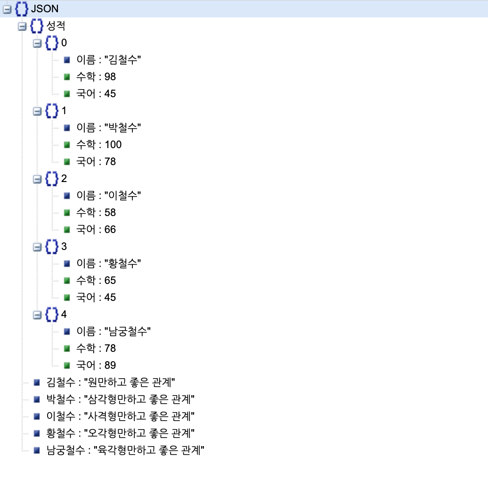
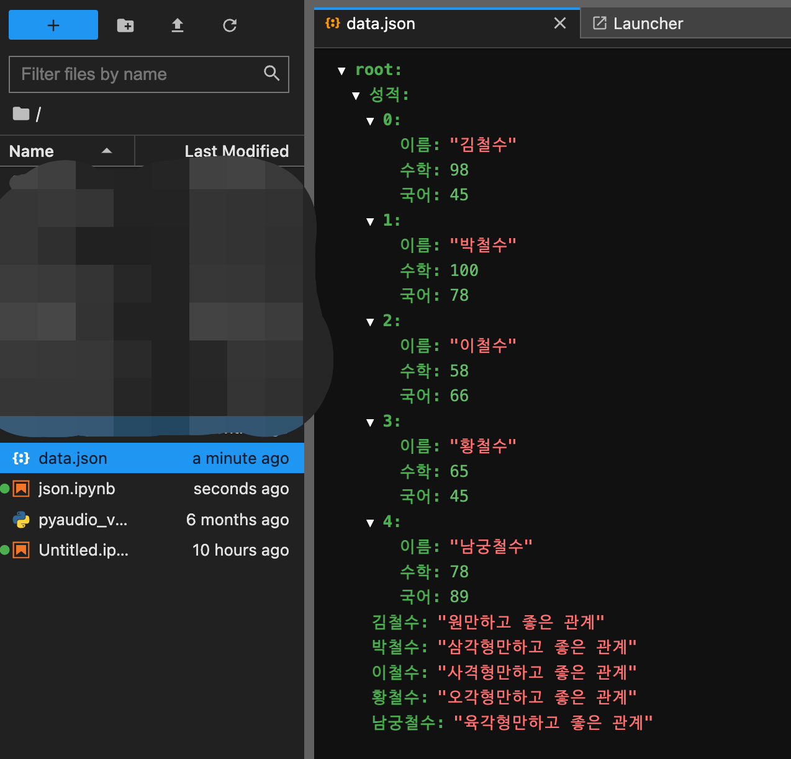

<!--postNo: 20230806_002-->

## Intro  

파이썬에서 json 형태의 자료를 읽고 쓰는 경우는 정말 많습니다.  
특히나 데이터를 분석하거나, API 통신을 통해 데이터를 주고받을 경우에는 더더욱 그렇죠.  

오늘은 파이썬에서 json 형태의 자료들을 다루는 방법에 대해 알아보겠습니다.  

<br>
<br>

## JSON  

JSON이란 속성-값 쌍, 배열 자료형 또는 기타 모든 시리얼화 가능한 값 또는 키-값 쌍으로 이루어진 데이터 오브젝트를 표현하는 포맷입니다.  

글만으로는 설명이 어려우니 예시를 하나 들어보겠습니다.  

학생들의 이름, 점수, 교우관계 데이터를 각각 가지고있다고 생각해봅시다.

```python
name_list = ["김철수", "박철수", "이철수", "황철수", "남궁철수"]
math_score = [98, 100, 58, 65, 78]
korean_score = [45, 78, 66, 45, 89]
gyowoo = {"김철수" : "원만하고 좋은 관계",
          "박철수" : "삼각형만하고 좋은 관계",
          "이철수" : "사격형만하고 좋은 관계",
          "황철수" : "오각형만하고 좋은 관계",
          "남궁철수" : "육각형만하고 좋은 관계"}
```

이 자료들에는 이름이나 점수와 같이 리스트(배열) 형태의 자료도 있고, 교우관계와 같이 키-값 쌍으로 이루어진 데이터도 있습니다.  

이 자료들을 하나로 묶을 수 있을까요?  
JSON 형태로 하나로 묶으면 아래와 같이 됩니다.  

```python
{'성적': {'0': {'이름': '김철수', '수학': 98, '국어': 45},
         '1': {'이름': '박철수', '수학': 100, '국어': 78},
         '2': {'이름': '이철수', '수학': 58, '국어': 66},
         '3': {'이름': '황철수', '수학': 65, '국어': 45},
         '4': {'이름': '남궁철수', '수학': 78, '국어': 89}},
 '김철수': '원만하고 좋은 관계',
 '박철수': '삼각형만하고 좋은 관계',
 '이철수': '사격형만하고 좋은 관계',
 '황철수': '오각형만하고 좋은 관계',
 '남궁철수': '육각형만하고 좋은 관계'}
```

JSON viewer 를 통해 이를 좀 더 시각적으로 잘 이해할 수 있게 만들어보겠습니다.  

  


<br>
<br>

## 파이썬에서 JSON 다루기  

### JSON 라이브러리  

|메서드|이름풀이|설명|
|---|---|---|
|dump|dump|파일 객체에 json 데이터를 저장|
|load|load|파일 객체에서 json 데이터를 불러옴|
|dumps|dump + string|json 데이터를 문자열 형태로 변환|
|loads|load + string|문자열을 json 데이터로 변환|

즉, s 가 붙은 경우, 문자열과 json 형태 간의 변환 기능이며, dump 와 load 는 파일 객체를 대상으로 합니다.  


### dump - JSON 으로 저장  

그렇다면 위 자료를 JSON 파일로 만들어보도록 하겠습니다.  

```python
import json

data = {'성적': {'0': {'이름': '김철수', '수학': 98, '국어': 45},
                '1': {'이름': '박철수', '수학': 100, '국어': 78},
                '2': {'이름': '이철수', '수학': 58, '국어': 66},
                '3': {'이름': '황철수', '수학': 65, '국어': 45},
                '4': {'이름': '남궁철수', '수학': 78, '국어': 89}},
        '김철수': '원만하고 좋은 관계',
        '박철수': '삼각형만하고 좋은 관계',
        '이철수': '사격형만하고 좋은 관계',
        '황철수': '오각형만하고 좋은 관계',
        '남궁철수': '육각형만하고 좋은 관계'}

path = "./data.json"

with open(path, "w") as f:
    json.dump(data, f)

```

  


### load - JSON 파일 읽어오기

위에서 만든 JSON 파일을 읽어와보겠습니다.  

```python
import json

path = "./data.json"

with open(path, "r") as f:
    new_data = json.load(f)

print(data)

>>> {'성적':
>>> {
>>> '0': {'이름': '김철수', '수학': 98, '국어': 45},
>>> '1': {'이름': '박철수', '수학': 100, '국어': 78},
>>> '2': {'이름': '이철수', '수학': 58, '국어': 66},
>>> '3': {'이름': '황철수', '수학': 65, '국어': 45},
>>> '4': {'이름': '남궁철수', '수학': 78, '국어': 89}
>>> },
>>> '김철수': '원만하고 좋은 관계',
>>> '박철수': '삼각형만하고 좋은 관계',
>>> '이철수': '사격형만하고 좋은 관계',
>>> '황철수': '오각형만하고 좋은 관계',
>>> '남궁철수': '육각형만하고 좋은 관계'
>>> }
```

### dumps  

dumps 는 python dict 형태의 데이터를 문자열 형태로 변환하는 작업을 수행합니다.  

```python
import json

data = {"name": "Alice", "age": 30}
json_str = json.dumps(data, ensure_ascii=False)

print(json_str)
```

```bash
'{"name": "Alice", "age": 30}'
```

### loads  

loads 는 문자열로 표햔된 json 데이터를 python dict 형태로 읽어오는 작업을 수행합니다.  

```python
import json

json_str = '{"name": "Alice", "age": 30}'
data = json.loads(json_str)

print(data)
```

```bash
{"name": "Alice", "age": 30}
```


### encoding  

파일을 읽어올 때 특정 문자를 읽어들여오지 못하는 디코딩 에러가 발생할 때가 있습니다.  
이런 경우 open 메서드에서 encoding 옵션을 주면 됩니다.  

```python
import json

path = "./data.json"

with open(path, "r", encoding="cp949") as f:
    new_data = json.load(f)

# cp949, UTF8 등
```

<br>
<br>

## Reference  

JSON이란 : https://ko.wikipedia.org/wiki/JSON  
JSON 라이브러리 : https://nerogarret.tistory.com/71  
디코딩 에러 : https://young-cow.tistory.com/23  
JSON viewer : https://jsonviewer.stack.hu/  