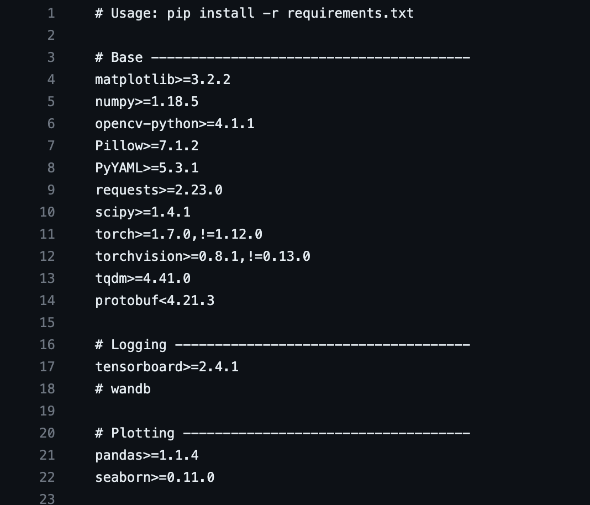

<!--postNo: 20230806_003-->

# <span style='background:linear-gradient(to top, #e8ff94 50%, transparent 50%)'>Intro</span>  

파이썬에서 열심히 개발을 하고 있는데.. 혼자 힘에는 부칩니다.  
함께 할 동료들을 모아 팀을 구성했습니다.  

팀에 개발 소스를 나눠줬는데, 이 소스를 구동시키려면 나와 동일한 "개발 환경" 또한 갖춰져야 합니다.  
그래서 설명을 하기 시작합니다. "A 라이브러리, B 라이브러리가 필요하고, B 라이브러리를 구동하려면 C와 D 라이브러리가 필요하고..."  

개발환경을 전달해주는 사람도, 전달받는 사람도 여간 귀찮은 일이 아닐 수 없습니다.  
더 쉽게 개발환경을 전달해줄 수 없을까요?  

오늘은 개발환경 즉 설치해야하는 라이브러리들을 추출하는 방법에 대해 알아보겠습니다.  

## requirements.txt  

파이썬을 통해 개발을 하다보면 "requirements.txt" 파일을 접하신 적이 한 번쯤은 있을 겁니다.  
혹은 `pip install -r requirements.txt` 와 같은 명령어를요.  

이 requirements.txt 파일에는 아래와 같이 라이브러리의 이름과 버전이 명시되어있습니다.  



그리고 이러한 requirements.txt 파일이 있다면 아래 명령어로 손쉽게 라이브러리들을 설치할 수 있습니다.

```terminal
pip install -r requirements.txt
```

이번에 알아볼 방법으로 이 "requirements.txt" 를 만들 수 있습니다.  

<br>
<br>

# <span style='background:linear-gradient(to top, #e8ff94 50%, transparent 50%)'>pip freeze</span>  

현재 파이썬 환경에 설치된 라이브러리 목록을 추출하는 것은 굉장히 단순합니다.  

```terminal

(base)user $ pip freeze > ./requirements.txt

```

끝입니다.  

이렇게 추출한 라이브러리 목록은 앞서 살펴본 것과 같이 설치가 가능하죠.  

```terminal

(base)user $ pip install -r ./requirements.txt

```

<br>
<br>

# <span style='background:linear-gradient(to top, #e8ff94 50%, transparent 50%)'>Reference</span>

수업